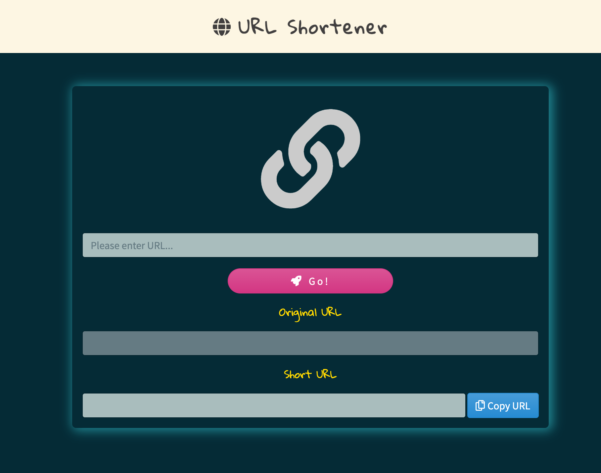

<!-- ABOUT THE PROJECT 2-3 A14: 短網址產生器 -->
## :globe_with_meridians: URL Shortener

:moyai:
You can see on [heroku]()

### :card_file_box: Features



1. User can paste a URL, and click the 'Go!' button, this web will generate a short URL.

2. User can copy the short URL to the clipboard.


<!-- GETTING STARTED -->
## :bulb: Getting Started

#### Clone repository
```
$ git clone 
```
#### Install by npm
```
$ npm install
```
#### Execute
```
$ npm run dev
```
#### Browse the website on localhost
```
http://localhost:3000/
```


### 🔧  Built With

* [Node.js](https://nodejs.org/en/) (^10.15.0)
* [Express](https://expressjs.com/)   (^4.17.1)
* [Express-Handlebars](https://www.npmjs.com/package/express-handlebars) (^5.3.2)
* [Bootstrap](https://getbootstrap.com) (^4.6.0)
* [mongoose](https://mongoosejs.com/) (^5.12.11)
